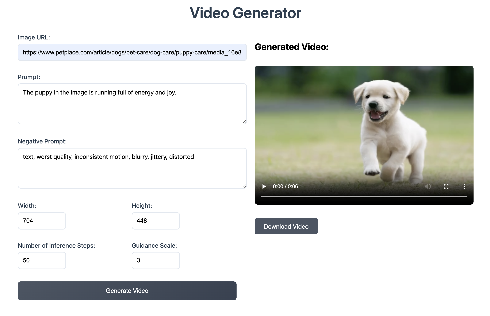

# Image to Video Converter

A full-stack application that converts static images into videos using LTX-Video. The project consists of a SvelteKit frontend and a FastAPI backend service.


## About the Project

This application allows users to upload images and convert them into videos using the LTX-Video model. The project is split into two main components:

- **Frontend**: Built with SvelteKit
- **Backend**: Using the LTX-Video model and FastAPI

## About LTX-Video Model

LTX-Video is a video generation model that does image-to-video and text-to-video generation. Image-to-video is used in this project

### Model Capabilities
- Resolution: Works best with resolutions under 720 x 1280
- Frame Count: Supports up to 257 frames
- Input Requirements:
  - Resolutions must be divisible by 32
  - Number of frames must be divisible by 8 + 1 (e.g., 257)
### Limitations
- Video generation might not perfectly match prompts
- Quality depends heavily on prompting style


### Model Parameters
For this project you can fill the parameters except number of frames and , we use the following parameters:

```python
{
    "width": 704,          
    "height": 480,         
    "guidance_scale": 7.5,
    "num_inference_steps": 50,  
    "num_frames": 161,
    "fps": 24,            
}
```
#### Additional Parameters
- **prompt**: Use English language prompts and detailed, elaborate prompts work best
- **negative_prompt**: what you don't want in you video
- You can find more information about the parameters in the model [documentation](https://huggingface.co/docs/diffusers/main/en/api/pipelines/ltx_video#diffusers.LTXImageToVideoPipeline)


### Example Output
Will be added
#### Input Image
Will be added
## Getting Started

Follow the steps below to deploy Image-to-Video converter to your Koyeb account.

## Requirements
To use this repository, you need:
- A Koyeb account to build the Dockerfile and deploy it to the platform. If you don't already have an account, you can sign-up for free.
- Access to GPU Instances on Koyeb.


### Running the Application
Remember to first deploy the frontend and then the backend 

#### Frontend
[](https://app.koyeb.com/deploy?name=image-to-video-frontend&repository=minettebrink%2Fimage_to_video&branch=main&workdir=front_end&builder=dockerfile&dockerfile=.%2FDockerfile&instance_type=small&regions=par&env%5BVITE_BACKEND_URL%5D=https%3A%2F%2Fvocal-lorie-challenge-ff910da8.koyeb.app&ports=5173%3Bhttp%3B%2F&hc_protocol%5B5173%5D=tcp&hc_grace_period%5B5173%5D=5&hc_interval%5B5173%5D=30&hc_restart_limit%5B5173%5D=3&hc_timeout%5B5173%5D=5&hc_path%5B5173%5D=%2F&hc_method%5B5173%5D=get)

#### Backend
[](https://app.koyeb.com/deploy?name=image-to-video-backend&repository=minettebrink%2Fimage_to_video&branch=main&workdir=%2Fback_end&builder=dockerfile&dockerfile=.%2FDockerfile&instance_type=gpu-nvidia-l40s&regions=eu&instances_min=0&autoscaling_sleep_idle_delay=300&env%5BALLOWED_ORIGINS%5D=https%3A%2F%2Fridiculous-kai-challenge-f777c3cf.koyeb.app&hc_grace_period%5B8000%5D=900&hc_interval%5B8000%5D=60&hc_timeout%5B8000%5D=60)

### Fork and deploy to Koyeb
If you want to customize and enhance this application, you need to fork this repository.

If you used the Deploy to Koyeb button, you can simply link your service to your forked repository to be able to push changes. Alternatively, you can manually create the application as described below.

On the Koyeb Control Panel, on the Overview tab, click the Create Web Service button to begin.

Select GitHub as the deployment method.
Choose the repository containing your application code.

#### For the frontend: 
- For configure builder, select Dockerfile and put ./Dockerfile in the docker file location and in Work directory /front_end.
- Afer you get the backend, add the url as an enviormental variable with the name VITE_BACKEND_URL.
- In the Instance section, select the CPU category and choose Small.
- Add to Configure ports Port 5173 and Protocol HTTP.
- Click Deploy.
- The repository will be pulled, built, and deployed on Koyeb. Once the deployment is complete, it will be accessible using the Koyeb subdomain for your service.

#### For the backend: 
- For configure builder, select Dockerfile and put ./Dockerfile in the docker file location and in Work directory /back_end.
- Afer you deployed the frontend, add the url as an enviormental variable with the name ALLOWED_ORIGINS.
- In the Instance section, select the GPU category and choose L40s.
- Add to Configure ports Port 8000 and Protocol HTTP.
- In the Health checks section, set the Grace period to 900 seconds, and Interval and Timeout to 60s. This will provide time for LTX-Video to download from Hugging Face and initialize the server.
- Click Deploy.
- The repository will be pulled, built, and deployed on Koyeb. Once the deployment is complete, it will be accessible using the Koyeb subdomain for your service.


## Troubleshooting

Common issues and their solutions: 
* **Port Conflicts**: Ensure ports 8000 (backend) and 5173 (frontend) are available and that the frontend and backend URLs are correct


## Helpful links
* [LTX-Video](https://huggingface.co/Lightricks/LTX-Video)
* [Koyeb Documentation](https://www.koyeb.com/docs)
* [SvelteKit](https://kit.svelte.dev/)
* [FastAPI](https://fastapi.tiangolo.com/)
* [Docker](https://www.docker.com/)