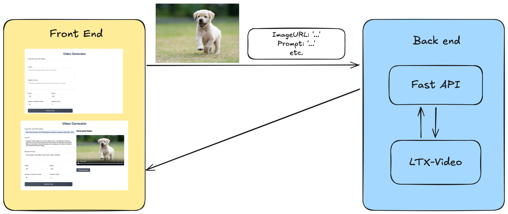

# Image to Video Converter

A full-stack application that converts static images into videos using LTX-Video. The project consists of a SvelteKit frontend and a FastAPI backend service.

You can watch the short [demo](https://youtu.be/eZfTr2Mq9d8) of the project and read the [tutorial](tutorial.md) to learn how to build it yourself!


## About the Project



This application allows users to upload images and convert them into videos using the LTX-Video model. The project is split into two main components:

- **Frontend**: Built with SvelteKit
- **Backend**: Using the LTX-Video model and FastAPI

## About LTX-Video Model

[LTX-Video](https://huggingface.co/Lightricks/LTX-Video) is a video generation model that generates image-to-video and text-to-video content. Image-to-video is used in this project.

### Model Capabilities
- Resolution: Works best with resolutions under 720 x 1280
- Frame Count: Supports up to 257 frames
- Input Requirements:
    -  Resolutions must be divisible by 32
    - The number of frames must be divisible by 8 + 1 (e.g., 257)

### Limitations
- Video generation might not perfectly match prompts
- Quality depends heavily on prompting style


### Model Parameters
For this project, you can fill in the parameters except the number of frames, and we use the following parameters:

```python
{
    "width": 704,          
    "height": 448,         
    "guidance_scale": 3.0,
    "num_inference_steps": 50,  
    "num_frames": 161,           
}
```
#### Additional Parameters
- **prompt**: Use English language prompts, and detailed, elaborate prompts work best.
- **negative_prompt (optional)**: what you don't want in your video.
- You can find more information about the parameters in the model [documentation](https://huggingface.co/docs/diffusers/main/en/api/pipelines/ltx_video#diffusers.LTXImageToVideoPipeline).


#### Input Image and Prompt


- **Prompt:** A golden-brown puppy runs across a green lawn, its small paws kicking up grass as it moves. Its ears bounce with each stride. Its dark eyes are focused ahead. In the slightly blurred background, the expanse of the lawn stretches out, bordered by dense foliage.
- **Negative Prompt:** worst quality, inconsistent motion, blurry, jittery, distorted
- **Other Parameters:** Defeault

### Example Output


