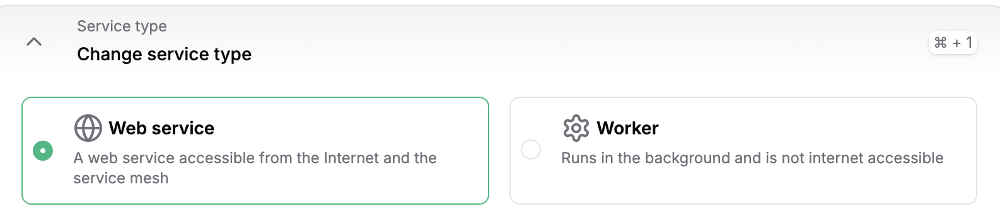
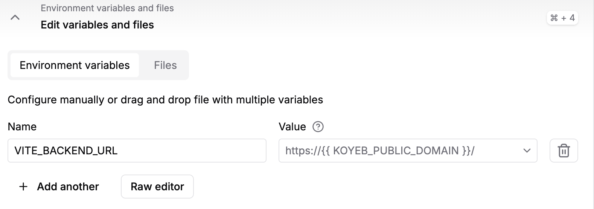
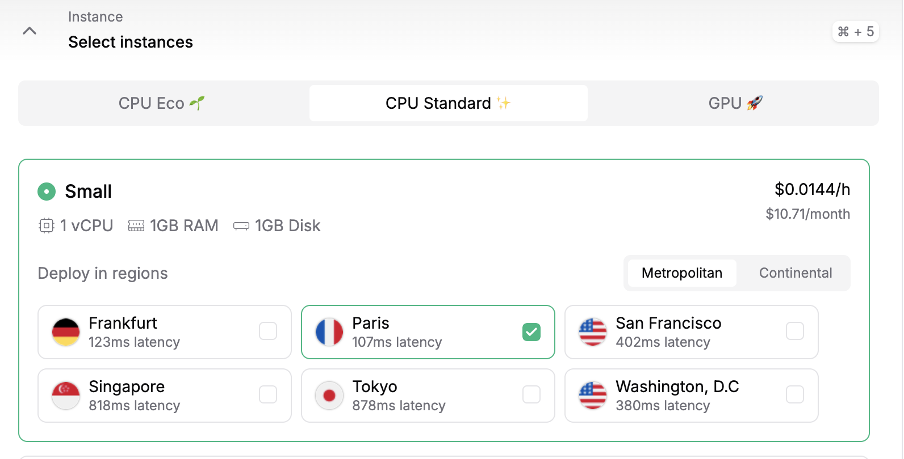
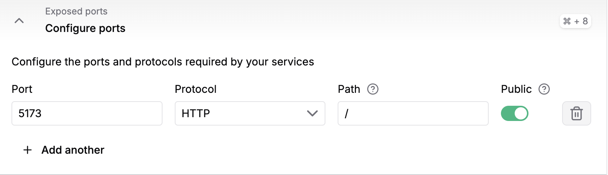
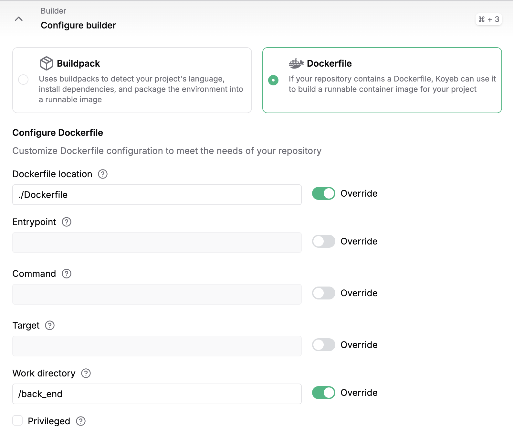
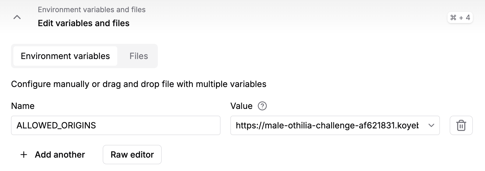
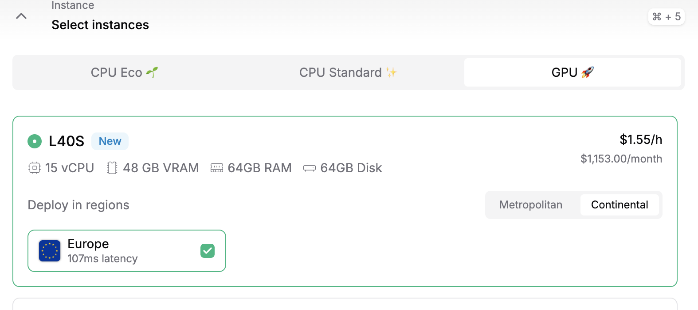
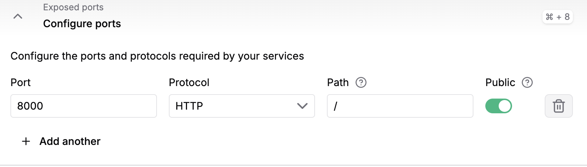
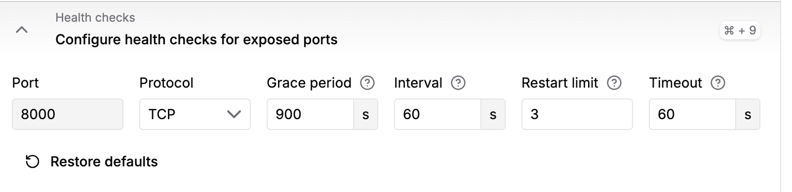

# Step-by-step Guide to Build a Image-to-Video Generator App

- setting up frontend sveltekit
- setting upp backend fast api
- connecting backend with frontend
- added parameters
- Tested deployment infra structur by dockerising front end and backend -didn’t work
- Composed dockered frontend and backend
- deployed on koyeb to test infrastructure pipeline. 
    - Problem with port (didn’t have 0.0.0.0: on frontend or backend)
    - Problem with a two small part of server
    - Got the frontend part to work, didn’t connect to backend
    - Cors problems
    - Then worked
- Backend done: 
    - Model download works on koyeb
    - Model start works on Koyeb
    - Adding parameters to model 
- Tryed with docker-compose.yml. Didn’t work, couldn’t find the model easily, python didn’t work in the console/shell and too many small bumps in the road
- Used the docker file instead when i figured how ot redirect

## Getting Started

Follow the steps below to deploy an Image-to-Video converter to your Koyeb account.

## Requirements
To use this repository, you need:
- A Koyeb account to build the Dockerfile and deploy to the platform. If you don't already have an account, you can sign up for free, linkt to [sign up](https://app.koyeb.com/auth/signup)
- Access to GPU Instances on Koyeb.


### Running the Application
Remember first to deploy the frontend and then the backend. 

#### Frontend
[](https://app.koyeb.com/deploy?name=image-to-video-frontend&repository=minettebrink%2Fimage-to-video&branch=main&workdir=front_end&builder=dockerfile&dockerfile=.%2FDockerfile&instance_type=small&regions=par&env%5BVITE_BACKEND_URL%5D=https%3A%2F%2Fhelpful-cloe-challenge-0065b024.koyeb.app&ports=5173%3Bhttp%3B%2F&hc_protocol%5B5173%5D=tcp&hc_grace_period%5B5173%5D=5&hc_interval%5B5173%5D=30&hc_restart_limit%5B5173%5D=3&hc_timeout%5B5173%5D=5&hc_path%5B5173%5D=%2F&hc_method%5B5173%5D=get)

#### Backend
[](https://app.koyeb.com/deploy?name=image-to-video-backend&repository=minettebrink%2Fimage-to-video&branch=main&workdir=%2Fback_end&builder=dockerfile&dockerfile=.%2FDockerfile&instance_type=gpu-nvidia-l40s&regions=eu&instances_min=0&autoscaling_sleep_idle_delay=300&env%5BALLOWED_ORIGINS%5D=https%3A%2F%2Fmale-othilia-challenge-af621831.koyeb.app&hc_grace_period%5B8000%5D=900&hc_interval%5B8000%5D=60&hc_timeout%5B8000%5D=60)

## Deploy on Koyeb

If you use the Deploy to Koyeb button, you can link your service to your forked repository to be able to push changes. Alternatively, you can manually create the application as described below.


When clicking Creat Service on your Koyeb account, then choose GitHub and add the link to your public GitHub repo. After choosing instance, click the Create Web Service button.



Select GitHub as the deployment method.
Choose the repository containing your application code.


#### For the frontend: 
- To configure the builder, select Dockerfile and write `./Dockerfile` in the docker file location and in the Work directory `/front_end`. 
    
    <imgx src="assets/builder_frontend.png" width="500" alt="Builder Frontend">
- After you the backend has started, add the URL as an environment variable with the name `VITE_BACKEND_URL`. 
    
    
- In the Instance section, select the CPU category and choose Small. 
    
    
- Add to Configure ports Port 5173 and Protocol HTTP. 
    
    
- Click Deploy!
- The repository will be pulled, built, and deployed on Koyeb. Once the deployment is complete, it will be accessible using the Koyeb subdomain for your service 🚀

#### For the backend: 
- To configure the builder, select Dockerfile and write `./Dockerfile` in the docker file location and the Work directory `/back_end`. 

    
- After you've deployed the front end, add the front end URL as an environment variable with the name `ALLOWED_ORIGINS` to the backend. 
   
    
- In the Instance section, select the GPU category and choose L40s. 
    
    
- Add to Configure ports Port the port you chose and Protocol HTTP. 

    
- In the Health checks section, set the Grace period to 900 seconds and Interval and Timeout to 60s. This will allow LTX-Video to download from Hugging Face and initialise the server. 

    
- Click Deploy.
- The repository will be pulled, built, and deployed on Koyeb. And you're ready to go 🚀 

 

## Running locally 

Running the backend and frontend locally isn't nessacary but if you want to fork the repo, make changes and play around with it, here's a small guide.

### Backend

Note that to run the model locally you'll need a GPU on your machine.

First pip install the [requirements](back_end/requirements.txt), preferrably in a virual environment:
```bash
pip install -r requirements.txt
```

I've also included a small python script to download the correct model weights. When iterating locally you don't need to run this before starting the backend server.
```python
from huggingface_hub import hf_hub_download
hf_hub_download(repo_id="Lightricks/LTX-Video", filename="ltx-video-2b-v0.9.1.safetensors", local_dir="/models")
```

And to start the backend locally in dev mode, run:
```bash
fastapi dev main.py
```

If you're using docker you can instead run and build it locally like so:
```bash
docker build -t my-image-name .
docker run -d -p <port>:<port> --name my-container-name my-image-name
```

### Frontend
The front end is built with Svelte. To run the frontend locally, first install the dependencies:

```bash
pnpm install
```

and then run the server:
```bash
pnpm run dev
```

And the dockerized version:
```bash
docker build -t  my-image-name .
docker run -d -p 5173:5173 --name <app-name> 
```

## Troubleshooting

Common issues and their solutions: 
* **Port Conflicts**: Ensure ports backend and 5173 (frontend) are available and that the frontend and backend URLs are correct
* **Two or more requests** : If there are two or more requests at the same time, there backe end might fail. This is because for both videos file name would be `output.mp4`. This is fine for demostration purposes but needs to be corrected for production.

## Helpful links
* [LTX-Video](https://huggingface.co/Lightricks/LTX-Video)
* [Koyeb Documentation](https://www.koyeb.com/docs)
* [SvelteKit](https://kit.svelte.dev/)
* [FastAPI](https://fastapi.tiangolo.com/)
* [Docker](https://www.docker.com/)


Link to demo https://youtu.be/eZfTr2Mq9d8

